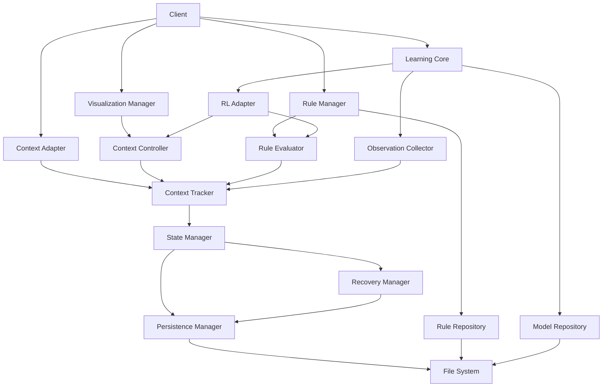

# Context Management System Overview

## System Architecture

The Context Management System is responsible for maintaining and synchronizing the development environment's state and context. It consists of several key components that work together to provide a robust foundation for context-aware operations.

### 1. Context System
The core context system manages state representation and tracking:

- **Context State**
  - Versioned state data
  - Update timestamps
  - Serialized content
  - Rule-based context metadata

- **Context Tracker**
  - State tracking
  - Version management
  - Thread-safe access
  - Rule prioritization and application

- **Context Factory**
  - Dependency injection
  - Configurable creation
  - Component composition
  - Rule configuration support

### 2. State Management
Handles state persistence and recovery:

- **State Manager**
  - State transitions
  - State validation
  - Repository integration
  - Rule-based state transitions

- **State Repository**
  - State storage
  - State retrieval
  - Snapshot management
  - Rule storage and indexing

- **Persistence Manager**
  - File system operations
  - Atomic state updates
  - Snapshot management
  - Rule persistence and versioning

### 3. Recovery System
Manages state recovery and snapshot management:

- **Recovery Manager**
  - Recovery points
  - State restoration
  - Snapshot rotation
  - Integrity verification
  - Rule-based recovery strategies

### 4. Context Adapter
Connects the context system to other components:

- **Context Adapter**
  - Protocol translation
  - Integration support
  - Specialized context handling
  - Configuration management
  - Rule application and validation

### 5. Rule Management System (New)
Manages rules for context-aware operations:

- **Rule Manager**
  - Rule parsing and validation
  - Rule prioritization
  - Rule storage and retrieval
  - Rule versioning

- **Rule Evaluator**
  - Context-aware rule evaluation
  - Rule matching and application
  - Performance optimization
  - Caching mechanisms

- **Rule Repository**
  - Rule storage in .rules directory
  - Rule organization by category
  - Rule metadata management
  - Rule indexing for fast retrieval

### 6. Context Visualization (New)
Provides visualization capabilities for context:

- **Visualization Manager**
  - Context state representation
  - Rule dependency visualization
  - Real-time context updates
  - Interactive control interfaces

- **Context Controller**
  - Manual context modification
  - Rule application overrides
  - Context reset capabilities
  - State transition control

### 7. Learning System (New)
Provides intelligent adaptation through machine learning:

- **Learning Core**
  - Model management
  - Training coordination
  - Observation processing
  - Reward calculation

- **Observation Collector**
  - Interaction tracking
  - State change monitoring
  - User feedback collection
  - Event correlation

- **Reinforcement Learning Adapter**
  - Environment abstraction
  - Action recommendation
  - State representation
  - Reward optimization

- **Learning Models**
  - Reinforcement learning algorithms
  - Context state prediction
  - Rule effectiveness learning
  - Adaptive optimization

## System Interaction

## Core Features

### Context Management
- Thread-safe state tracking
- Version-based conflict resolution
- Atomic state updates
- Context lifecycle management
- Rule-based context modifications

### State Management
- Persistent state storage
- State versioning
- Recovery mechanisms
- State validation
- Rule-influenced state transitions

### Recovery System
- Snapshot creation and management
- Point-in-time recovery
- Automatic snapshot rotation
- Integrity validation
- Rule-aware recovery strategies

### Context Adapter
- Clean separation of concerns
- Protocol-specific adaptation
- Integration support
- Configuration management
- Rule integration points

### Rule Management (New)
- Rule parsing and validation
- Rule prioritization and application
- Context-aware rule evaluation
- Rule caching for performance
- Rule organization in .rules directory

### Context Visualization and Control (New)
- Visual representation of context state
- Rule dependency visualization
- Interactive context modification
- Real-time updates
- State transition visualization

### Learning System (New)
- Reinforcement learning for context optimization
- Intelligent rule selection and application
- Context state prediction
- Adaptive recovery point creation
- Learning-based performance optimization
- Usage pattern recognition

## Integration Points

### 1. MCP Integration
- MCP-specific context adapter
- Context-aware message handling
- Tool state tracking
- Event propagation
- Rule-based message handling

### 2. Command System Integration
- Context-aware command execution
- State tracking for commands
- Error recovery integration
- Context validation
- Rule-aware command execution

### 3. Rule System Integration (New)
- Rule-based context modification
- Rule evaluation during context changes
- Rule prioritization based on context
- Rule dependency resolution
- Near-context rule caching for performance

### 4. Learning System Integration (New)
- Observation collection during context operations
- Learning-based rule recommendation
- Optimal context state prediction
- Integration with visualization for model insights
- Adaptive recovery strategy optimization
- User feedback integration for reward signals

## Implementation Details

### 1. Thread Safety
- Uses `Arc<tokio::sync::RwLock<>>` and `Arc<tokio::sync::Mutex<>>` for state protection
- Implements proper async-aware locking strategy
- Handles concurrent access with minimal contention
- Avoids holding locks across await points to prevent deadlocks
- Uses explicit scope-based locking to minimize lock duration

### 2. Error Handling
- Comprehensive error types
- Proper error propagation
- Recovery mechanisms
- Clear error messages
- Rule-specific error handling

### 3. Asynchronous Programming
- Async/await for I/O operations
- Tokio runtime integration
- Proper cancellation handling
- Concurrent operation support
- Async rule evaluation

### 4. Serialization
- Efficient state serialization
- Binary format for state data
- JSON for human-readable parts
- Version tracking for compatibility
- Rule serialization and deserialization

### 5. Rule Storage (New)
- Rules stored in .rules directory
- Naming convention for organization
- YAML/Markdown-based rule format
- Metadata for rule prioritization
- Glob patterns for rule application scope

### 6. Visualization (New)
- Real-time context state visualization
- Interactive control mechanisms
- Rule dependency graphing
- State transition animations
- Performance metrics visualization

### 7. Learning Implementation (New)
- Multiple learning model support (DQN, PPO, Contextual Bandits)
- Asynchronous training to avoid blocking operations
- Observation buffering and batch processing
- Model persistence and versioning
- Incremental learning for continuous improvement
- Configurable reward functions

## Best Practices

1. **Context Updates**
   - Use atomic operations
   - Track versions
   - Validate state changes
   - Handle errors gracefully
   - Apply relevant rules

2. **State Management**
   - Persist state regularly
   - Create recovery points
   - Use efficient storage
   - Monitor performance
   - Track rule application impact

3. **Recovery**
   - Create regular snapshots
   - Implement rotation policies
   - Validate before recovery
   - Test recovery paths
   - Use rule-aware recovery strategies

4. **Integration**
   - Use the adapter pattern
   - Maintain separation of concerns
   - Document integration points
   - Test cross-component interaction
   - Validate rule application

5. **Async Lock Management**
   - Avoid holding locks across `.await` points
   - Use scope-based locking to minimize lock duration
   - Separate read and write operations
   - Use explicit drop points for locks
   - Clone data before processing to avoid holding locks

6. **Rule Management (New)**
   - Prioritize rules based on specificity
   - Cache frequently used rules in near context
   - Validate rule dependencies
   - Monitor rule evaluation performance
   - Maintain rule versioning

7. **Visualization (New)**
   - Update visualizations asynchronously
   - Throttle updates for performance
   - Provide multiple visualization levels
   - Make controls intuitive
   - Show rule impact on context

8. **Learning System (New)**
   - Use async training to avoid blocking operations
   - Implement configurable reward functions
   - Cache predictions for frequently used states
   - Monitor model performance and accuracy
   - Provide explainable recommendations
   - Allow manual override of learned behaviors
   - Start with simple models before complex ones

## Version History

- 1.0.0: Initial context system overview
  - Defined system architecture
  - Established core features
  - Documented integration points
  - Outlined best practices

- 1.1.0: Updated to align with implementation
  - Refined component architecture
  - Updated integration details
  - Added implementation details
  - Clarified component relationships

- 1.2.0: Final overview update
  - Confirmed complete implementation
  - Verified all components functioning
  - Aligned with current codebase
  - Updated for final release

- 1.3.0: Async mutex refactoring update
  - Replaced standard mutexes with async-aware alternatives
  - Improved thread safety with proper lock management
  - Added async lock best practices
  - Implemented benchmarks for concurrent operations

- 2.0.0: Expanded system capabilities
  - Added rule management system
  - Added visualization and control capabilities
  - Enhanced context with rule-based modifications
  - Added .rules directory support
  - Expanded integration points for rules

- 2.1.0: Learning system integration
  - Added reinforcement learning capabilities
  - Added observation collection system
  - Implemented learning models
  - Added learning visualization
  - Integrated learning with rules and context
  - Added adaptive optimization features

<version>2.1.0</version> 