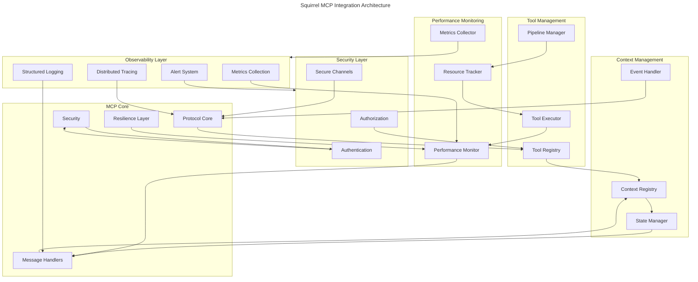
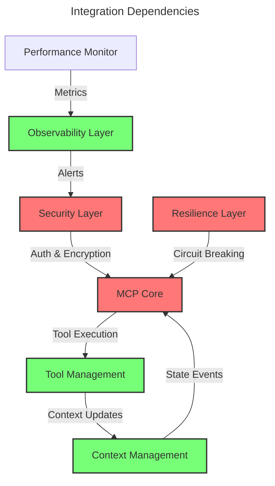
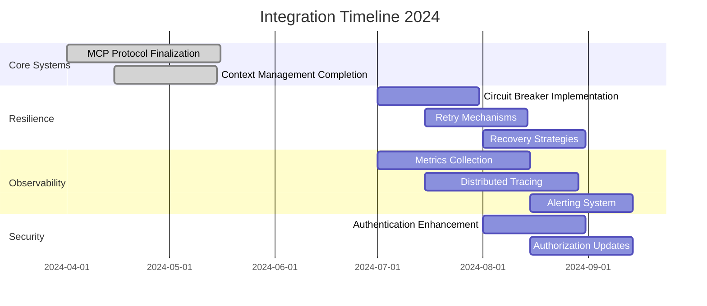
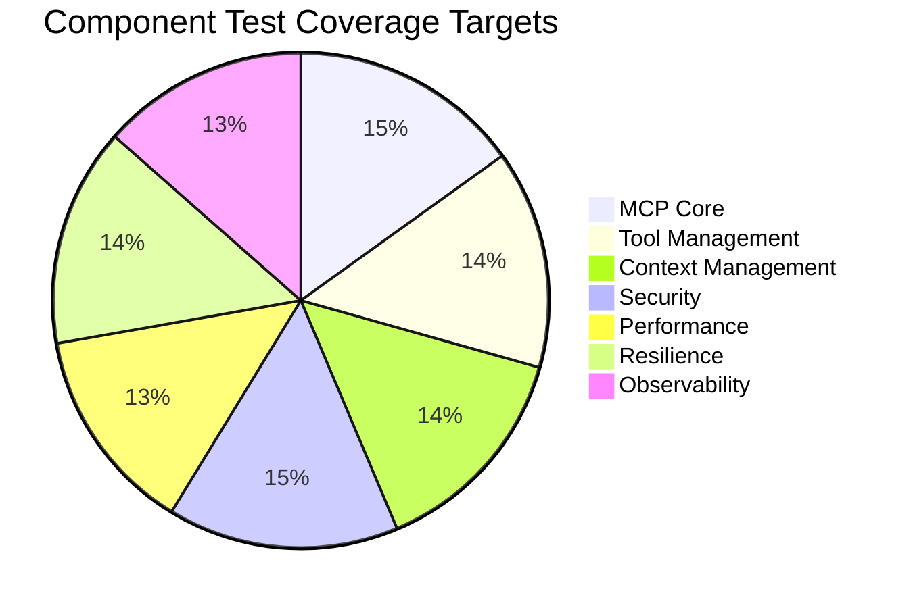

# Integration Specifications

This directory contains specifications for integrating various components of the Squirrel system.

## Current Focus: MCP-Monitoring Integration

The team is currently focused on implementing the integration between the MCP Resilience Framework's health monitoring component and the global monitoring system. This integration enables bidirectional communication for health status tracking and automated recovery.

### Implementation Status

- **Overall Status**: In Progress (90% complete)
- **Current Phase**: Addressing API compatibility issues
- **Reference**: See [MCP-Monitoring Integration](./mcp-monitoring-integration.md) for detailed specifications

### Core Components Implemented

1. **HealthMonitoringBridge**: Mediates between the MCP resilience health monitor and the monitoring system
2. **ResilienceHealthCheckAdapter**: Adapts resilience health checks to the monitoring system format
3. **AlertToRecoveryAdapter**: Converts monitoring alerts to resilience recovery actions

### Known Issues

We've encountered API compatibility issues between the original integration design and the actual monitoring system implementation. These include:

- Structure discrepancies in Alert and Metric types
- Type system differences affecting component access methods
- Initialization requirements not accounted for in the original design

### Implementation Plan

Our team has developed a comprehensive plan to address these issues:
1. Thorough analysis of the actual monitoring system API
2. Refactoring of adapter implementations to match actual types
3. Updated testing strategy with actual API components
4. Documentation updates to reflect correct API usage

For details, see the [Implementation Plan](../mcp/resilience-implementation/IMPLEMENTATION_PLAN.md).

### Timeline

- API Analysis: 2 days
- Adapter Redesign: 3 days
- Testing and Validation: 2 days
- Documentation Update: 1 day

## Other Integration Specifications

This directory also contains specifications for other integration points:

- Authentication integration
- RBAC integration
- Plugin system integration
- Data processing integration
- External API integration
- Storage system integration

Each specification includes detailed requirements, architecture diagrams, and implementation guidelines.

## Component Integration Map



## Integration Status Overview

| Component | Progress | Target | Priority |
|-----------|----------|---------|----------|
| MCP Protocol Core | 95% | Q3 2024 | High |
| Security Integration | 90% | Q3 2024 | High |
| Performance Integration | 85% | Q3 2024 | High |
| Plugin Integration | 75% | Q3 2024 | High |
| Tool Management | 90% | Q3 2024 | High |
| Context Management | 90% | Q3 2024 | High |
| Resilience Layer | 40% | Q4 2024 | High |
| Observability | 35% | Q4 2024 | High |

## Cross-Component Dependencies



## Integration Requirements Matrix

| Component | Dependencies | Security | Performance | Resilience | Observability |
|-----------|--------------|----------|-------------|------------|---------------|
| MCP Core | Security, Tools | E2E Encryption | < 50ms Processing | Circuit Breaker | Distributed Tracing |
| Tool Management | Context, MCP | Permission Check | < 100ms Execution | Retry Mechanism | Tool Metrics |
| Context Management | MCP | State Isolation | < 50ms Sync | Snapshot Recovery | State Metrics |
| Security | All Components | - | < 10ms Auth | Auth Failover | Security Events |
| Performance | All Components | Metrics Security | - | Resource Limits | Health Checks |
| Resilience | MCP, Context | Secure Recovery | Dynamic Scaling | - | Recovery Metrics |
| Observability | All Components | Event Encryption | Low Overhead | Self-Healing | - |

## Implementation Priorities



## Resilience Strategy

### Circuit Breaker Pattern
```rust
pub trait CircuitBreaker {
    async fn execute<F, T>(&self, operation: F) -> Result<T, BreakerError>
    where
        F: Future<Output = Result<T, Error>> + Send;
        
    async fn state(&self) -> BreakerState;
    async fn reset(&self) -> Result<()>;
    async fn trip(&self) -> Result<()>;
}

#[derive(Debug, Clone)]
pub enum BreakerState {
    Closed,     // Normal operation
    Open,       // Circuit broken, fast fail
    HalfOpen,   // Testing if system has recovered
}
```

### Retry Mechanism
```rust
pub trait RetryPolicy {
    async fn execute<F, T>(&self, operation: F) -> Result<T, RetryError>
    where
        F: Fn() -> Future<Output = Result<T, Error>> + Send + Sync;
        
    fn with_backoff(max_retries: u32, base_delay: Duration) -> Self;
    fn with_jitter(max_retries: u32, base_delay: Duration, jitter: f64) -> Self;
}
```

### Recovery Strategies
```rust
pub trait RecoveryStrategy {
    async fn recover<T>(&self, context: RecoveryContext) -> Result<T, RecoveryError>;
    async fn create_snapshot(&self) -> Result<Snapshot>;
    async fn restore_snapshot(&self, snapshot: Snapshot) -> Result<()>;
}

#[derive(Debug)]
pub struct RecoveryContext {
    pub error: Error,
    pub component: ComponentId,
    pub state: ComponentState,
    pub timestamp: DateTime<Utc>,
}
```

## Observability Framework

### Metrics Collection
```rust
pub trait MetricsCollector {
    fn record_counter(&self, name: &str, value: u64, labels: HashMap<String, String>);
    fn record_gauge(&self, name: &str, value: f64, labels: HashMap<String, String>);
    fn record_histogram(&self, name: &str, value: f64, labels: HashMap<String, String>);
    fn start_timer(&self, name: &str) -> Timer;
}
```

### Distributed Tracing
```rust
pub trait TracingProvider {
    fn create_span(&self, name: &str, parent: Option<SpanId>) -> Span;
    fn current_span(&self) -> Option<Span>;
    fn record_event(&self, event: TraceEvent);
}

#[derive(Debug, Clone)]
pub struct Span {
    pub id: SpanId,
    pub trace_id: TraceId,
    pub name: String,
    pub start_time: DateTime<Utc>,
    pub attributes: HashMap<String, Value>,
}
```

### Alerting System
```rust
pub trait AlertManager {
    async fn trigger_alert(&self, alert: Alert) -> Result<AlertId>;
    async fn resolve_alert(&self, id: AlertId) -> Result<()>;
    async fn get_active_alerts(&self) -> Result<Vec<Alert>>;
}

#[derive(Debug, Clone)]
pub struct Alert {
    pub id: Option<AlertId>,
    pub name: String,
    pub severity: AlertSeverity,
    pub message: String,
    pub source: String,
    pub timestamp: DateTime<Utc>,
    pub attributes: HashMap<String, Value>,
}
```

## Integration Testing Strategy

### Test Coverage Targets



### Critical Test Scenarios

1. **Resilience Testing**
   - Component failure recovery
   - Circuit breaker triggering and recovery
   - Retry policy with exponential backoff
   - State corruption and recovery
   - Partial system failures

2. **Performance Testing**
   - High-throughput message handling
   - Concurrent subscription management
   - Resource usage under load
   - Memory consumption patterns
   - Connection pooling efficiency

3. **Security Testing**
   - Authentication bypass attempts
   - Authorization boundary testing
   - Input validation and sanitization
   - Encryption effectiveness
   - Rate limiting and throttling

4. **Integration Testing**
   - Cross-component communication
   - Protocol version compatibility
   - Error propagation across boundaries
   - State synchronization
   - Event consistency

## Migration Guidelines

1. Version compatibility checks
2. State migration procedures
3. Protocol version updates
4. Security token updates
5. Performance baseline preservation
6. Graceful degradation during transitions
7. Backward compatibility for tools
8. Clear upgrade and rollback paths

## Documentation Standards

All integration specifications must include:
1. Component architecture diagrams
2. Interface definitions
3. Security considerations
4. Performance requirements
5. Test coverage requirements
6. Migration procedures
7. Resilience features
8. Observability integration points

## Version Control

This specification is version controlled alongside the codebase.
Updates are tagged with corresponding software releases.

---

Last Updated: 2024-04-15
Version: 1.2.0 