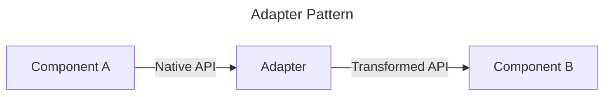
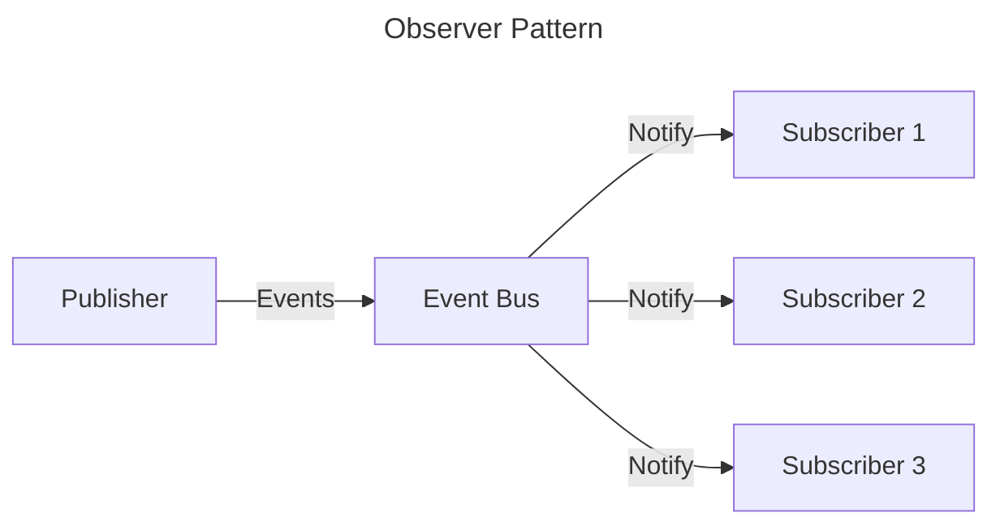
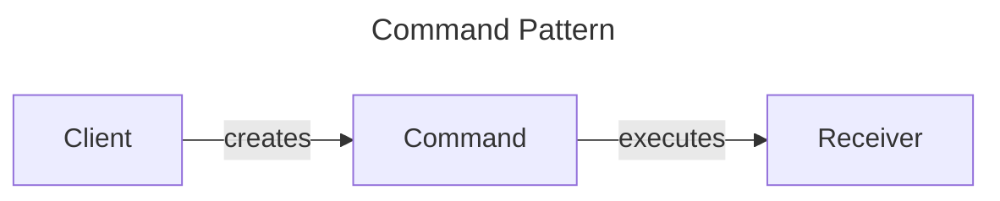
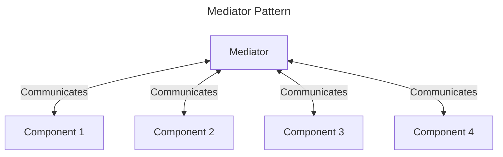
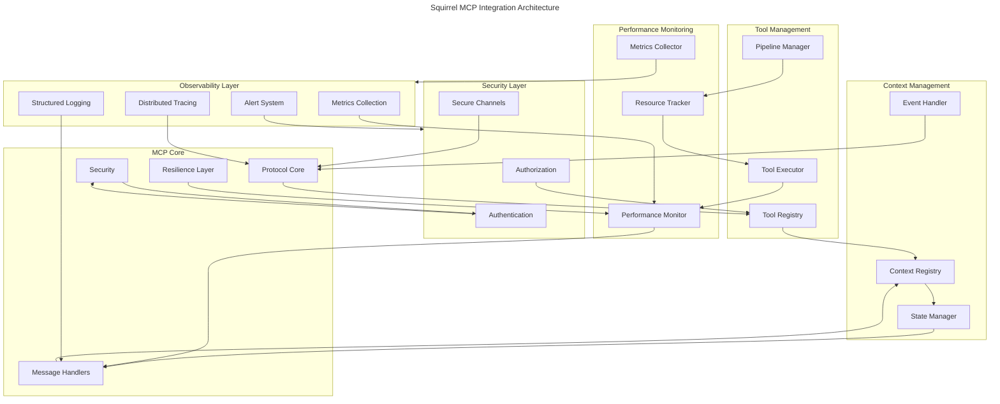
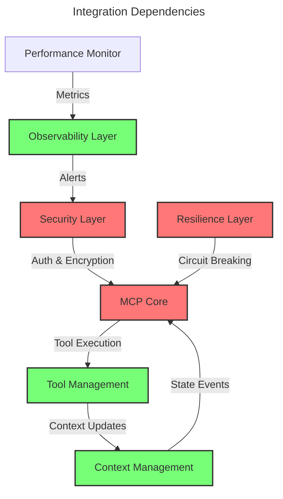
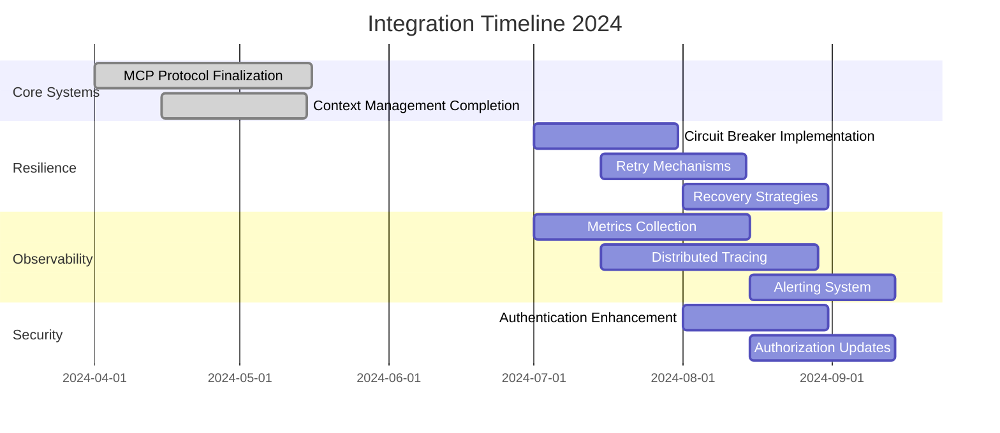
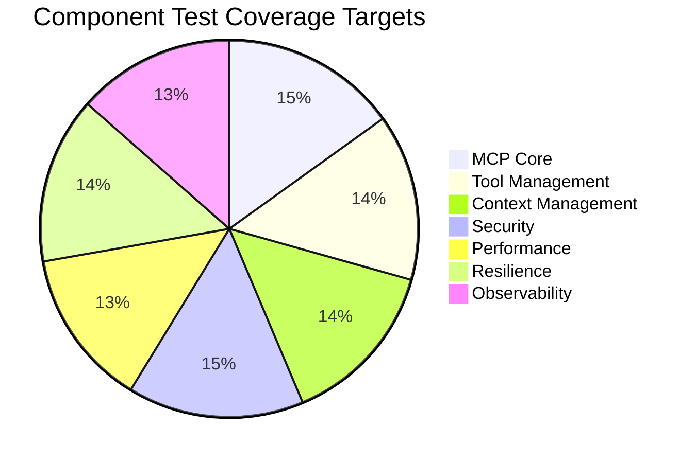

# Squirrel System Integrations

This directory contains documentation and implementation details for integrations between various subsystems of the Squirrel project. These integrations demonstrate how different components communicate and work together to form a cohesive system.

## Overview

System integrations in Squirrel follow a consistent pattern, typically using adapters to bridge between different subsystems. This approach allows each subsystem to maintain its own internal structure and concerns while providing clear integration points.

## Key Integration Patterns

1. **Adapter Pattern**: Used extensively to convert between subsystem interfaces
2. **Observer Pattern**: For event-based communication between components
3. **Facade Pattern**: To simplify complex subsystem interactions
4. **Command Pattern**: For encapsulating requests between subsystems

## Completed Integrations

All planned integrations for the current development phase have been implemented:

### Core Integrations
- **MCP-Monitoring Integration**: Bidirectional communication between MCP core and monitoring
- **Core-Monitoring Integration**: Connecting core components to monitoring
- **Dashboard-Monitoring Integration**: Connecting dashboard UI to monitoring data

### Framework Integrations
- **Resilience Framework Integration**: Patterns for fault tolerance across components
- **CLI-Monitoring Integration**: Command-line interface for monitoring system
- **External Tracing Integration**: Connection to external observability platforms

## Implementation Status

Current status of all integrations can be found in the [PROGRESS_UPDATE.md](./PROGRESS_UPDATE.md) file.

## Design Documents

Each integration has a corresponding design document that outlines:
- Purpose and scope
- Component interaction diagrams
- Interface definitions
- Data flow
- Error handling
- Configuration options

## Testing

Integration tests are available for each implemented integration:

```bash
# Run all integration tests
cargo test -p squirrel-mcp -- integration

# Run specific integration tests
cargo test -p squirrel-cli -- commands::tests::monitoring_command_test
cargo test -p squirrel-mcp -- observability::tests::external_tracing_test
```

A verification script is available to check integration implementations and run tests:

```bash
# Run verification script
./scripts/verify_integration.sh
```

## Example Usage

### CLI-Monitoring Integration

The CLI monitoring integration provides commands for interacting with the monitoring system:

```bash
# View health status of all components
squirrel monitoring health

# Filter health by component ID
squirrel monitoring health --component core-component-1

# View metrics with JSON output
squirrel monitoring metrics --format json

# View only critical alerts
squirrel monitoring alerts --severity critical
```

### External Tracing Integration

The External Tracing integration can be configured to export spans to OpenTelemetry, Jaeger, or Zipkin:

```rust
// Create a configuration for OpenTelemetry export
let config = ExternalTracingConfig {
    endpoint_url: "http://localhost:4317".to_string(),
    service_name: "squirrel-service".to_string(),
    environment: "production".to_string(),
    ..Default::default()
};

// Create an OpenTelemetry exporter
let exporter = Arc::new(OpenTelemetryExporter::new(config));

// Initialize the external tracer
let tracer = ExternalTracer::with_exporter(exporter);

// Start a span
let span_id = tracer.start_span("operation_name", Some("component_id"), None);

// Add events or attributes to the span
tracer.add_span_event(span_id, SpanEvent { /* ... */ });

// End the span
tracer.end_span(span_id, SpanStatus::Ok);

// Export spans to the OpenTelemetry collector
tracer.export_spans().await?;
```

## Contribution Guidelines

When implementing or modifying integrations:

1. Follow the established patterns for consistency
2. Add comprehensive tests for new integrations
3. Update the progress document with your changes
4. Include example usage in the integration documentation
5. Ensure error handling is consistent across integration points

## Future Integrations

See the [PROGRESS_UPDATE.md](./PROGRESS_UPDATE.md) file for upcoming integration work.

## Integration Specifications

This directory contains specifications for the integration between various components of the Squirrel system. These specifications define the interaction patterns, data exchange formats, and APIs used for component integration.

## Integration Status

| Integration | Status | Last Updated | Priority |
|-------------|--------|--------------|----------|
| Core-MCP | In Progress | 2024-03-31 | High |
| MCP-Monitoring | Implemented | 2024-04-01 | High |
| Core-Monitoring | Implemented | 2024-04-01 | High |
| Dashboard-Monitoring | Implemented | 2024-04-01 | High |
| UI-MCP | Planned | 2024-03-31 | Medium |
| Plugin-MCP | Planned | 2024-03-31 | Medium |
| Context-Management | Planned | 2024-03-31 | Medium |
| Security | Planned | 2024-03-31 | Low |
| Testing | Planned | 2024-03-31 | Low |
| Tool-Management | Planned | 2024-03-31 | Low |

## Integration Components

### Implemented Integrations

#### MCP-Monitoring Integration

The integration between the MCP (Machine Context Protocol) and Monitoring systems provides bidirectional communication between these components:

- MCP components report health status to the monitoring system
- Monitoring system sends alerts to MCP for recovery actions
- Metrics flow from MCP to monitoring for visualization
- Recovery requests flow from monitoring to MCP

This integration establishes the foundation for system resilience and observability.

#### Core-Monitoring Integration

The integration between Core components and the Monitoring system enables:

- Core components to expose health status to monitoring
- Metrics collection from core components
- Alert generation based on core component status
- Standardized metrics collection for all core components

This integration ensures all core components are observable through the monitoring system.

#### Dashboard-Monitoring Integration

The integration between the Dashboard and Monitoring systems enables visualization of system metrics, health status, and alerts:

- Monitoring data is transformed into dashboard-compatible formats
- Real-time updates keep dashboard displays current
- Alerts are properly formatted for dashboard visualization
- A complete observability pipeline from data collection to visualization

This integration completes a critical piece of the observability pipeline, connecting the monitoring system's data collection capabilities with the dashboard's visualization capabilities, allowing system operators to effectively monitor and respond to system events.

### Planned Integrations

#### Core-MCP Integration

This integration will define how Core components interact with the MCP system, focusing on:

- Event-based communication between core and MCP
- State synchronization mechanisms
- Command dispatching from MCP to core components
- Resource sharing between core and MCP

#### UI-MCP Integration

This integration will define how UI components interact with the MCP system, focusing on:

- UI state management via MCP
- Event propagation from MCP to UI
- Command issuance from UI to MCP
- Real-time updates of UI based on MCP state

#### Plugin-MCP Integration

This integration will define how plugins interact with the MCP system, focusing on:

- Plugin registration with MCP
- Capability discovery and exposure
- Command handling by plugins
- Event propagation from plugins to MCP

## Integration Patterns

The following design patterns are used consistently across integration specifications:

### Adapter Pattern

The adapter pattern is used to convert between different component interfaces, ensuring loose coupling between components. This pattern is particularly important for integrating components with different data models or APIs.



### Observer Pattern

The observer pattern is used for event-based communication between components, allowing components to subscribe to events from other components without tight coupling.



### Command Pattern

The command pattern is used for encapsulating requests as objects, allowing for parameterization of clients with queuing, logging, and undoable operations.



### Mediator Pattern

The mediator pattern is used to reduce coupling between components by having them communicate indirectly through a mediator object.



## Directory Structure

The integration specifications are organized as follows:

```
specs/integration/
├── README.md                           # This file
├── PATTERNS.md                         # Common integration patterns
├── core-mcp-integration.md             # Core to MCP integration
├── core-monitoring-integration.md      # Core to Monitoring integration
├── mcp-monitoring-integration.md       # MCP to Monitoring integration
├── dashboard-monitoring-integration.md # Dashboard to Monitoring integration
├── ui-mcp-integration.md               # UI to MCP integration
├── plugin-mcp-integration.md           # Plugin to MCP integration
├── context-management-integration.md   # Context management integration
├── security-integration.md             # Security integration
├── testing-integration.md              # Testing integration
└── tool-management-integration.md      # Tool management integration
```

## Integration Guidelines

### 1. Component Boundaries

Components should have well-defined boundaries with clear interfaces for integration. Avoid tight coupling between components.

### 2. Consistent Patterns

Use consistent design patterns across all integrations to ensure maintainability and comprehension.

### 3. Error Handling

Define clear error handling strategies at integration boundaries, including error propagation, recovery mechanisms, and fallback behaviors.

### 4. Documentation

Document all integration points thoroughly, including data formats, API contracts, and expected behaviors.

### 5. Testing

Implement comprehensive integration tests that verify the correct interaction between components.

### 6. Performance

Consider performance implications of integration choices, ensuring minimal overhead for cross-component communication.

### 7. Security

Define security considerations at integration boundaries, including authentication, authorization, and data validation.

### 8. Versioning

Define versioning strategies for APIs and data formats to ensure backward compatibility during evolution.

## Implementation Status

The implementation of integrations is tracked in the PROGRESS_UPDATE.md file. As integrations are implemented, their status will be updated in this README and detailed implementation notes will be added to the corresponding specification documents.

<version>1.1.0</version>

## Current Focus: MCP-Monitoring Integration

The team is currently focused on implementing the integration between the MCP Resilience Framework's health monitoring component and the global monitoring system. This integration enables bidirectional communication for health status tracking and automated recovery.

### Implementation Status

- **Overall Status**: In Progress (90% complete)
- **Current Phase**: Addressing API compatibility issues
- **Reference**: See [MCP-Monitoring Integration](./mcp-monitoring-integration.md) for detailed specifications

### Core Components Implemented

1. **HealthMonitoringBridge**: Mediates between the MCP resilience health monitor and the monitoring system
2. **ResilienceHealthCheckAdapter**: Adapts resilience health checks to the monitoring system format
3. **AlertToRecoveryAdapter**: Converts monitoring alerts to resilience recovery actions

### Known Issues

We've encountered API compatibility issues between the original integration design and the actual monitoring system implementation. These include:

- Structure discrepancies in Alert and Metric types
- Type system differences affecting component access methods
- Initialization requirements not accounted for in the original design

### Implementation Plan

Our team has developed a comprehensive plan to address these issues:
1. Thorough analysis of the actual monitoring system API
2. Refactoring of adapter implementations to match actual types
3. Updated testing strategy with actual API components
4. Documentation updates to reflect correct API usage

For details, see the [Implementation Plan](../mcp/resilience-implementation/IMPLEMENTATION_PLAN.md).

### Timeline

- API Analysis: 2 days
- Adapter Redesign: 3 days
- Testing and Validation: 2 days
- Documentation Update: 1 day

## Other Integration Specifications

This directory also contains specifications for other integration points:

- Authentication integration
- RBAC integration
- Plugin system integration
- Data processing integration
- External API integration
- Storage system integration

Each specification includes detailed requirements, architecture diagrams, and implementation guidelines.

## Component Integration Map



## Integration Status Overview

| Component | Progress | Target | Priority |
|-----------|----------|---------|----------|
| MCP Protocol Core | 95% | Q3 2024 | High |
| Security Integration | 90% | Q3 2024 | High |
| Performance Integration | 85% | Q3 2024 | High |
| Plugin Integration | 75% | Q3 2024 | High |
| Tool Management | 90% | Q3 2024 | High |
| Context Management | 90% | Q3 2024 | High |
| Resilience Layer | 40% | Q4 2024 | High |
| Observability | 35% | Q4 2024 | High |

## Cross-Component Dependencies



## Integration Requirements Matrix

| Component | Dependencies | Security | Performance | Resilience | Observability |
|-----------|--------------|----------|-------------|------------|---------------|
| MCP Core | Security, Tools | E2E Encryption | < 50ms Processing | Circuit Breaker | Distributed Tracing |
| Tool Management | Context, MCP | Permission Check | < 100ms Execution | Retry Mechanism | Tool Metrics |
| Context Management | MCP | State Isolation | < 50ms Sync | Snapshot Recovery | State Metrics |
| Security | All Components | - | < 10ms Auth | Auth Failover | Security Events |
| Performance | All Components | Metrics Security | - | Resource Limits | Health Checks |
| Resilience | MCP, Context | Secure Recovery | Dynamic Scaling | - | Recovery Metrics |
| Observability | All Components | Event Encryption | Low Overhead | Self-Healing | - |

## Implementation Priorities



## Resilience Strategy

### Circuit Breaker Pattern
```rust
pub trait CircuitBreaker {
    async fn execute<F, T>(&self, operation: F) -> Result<T, BreakerError>
    where
        F: Future<Output = Result<T, Error>> + Send;
        
    async fn state(&self) -> BreakerState;
    async fn reset(&self) -> Result<()>;
    async fn trip(&self) -> Result<()>;
}

#[derive(Debug, Clone)]
pub enum BreakerState {
    Closed,     // Normal operation
    Open,       // Circuit broken, fast fail
    HalfOpen,   // Testing if system has recovered
}
```

### Retry Mechanism
```rust
pub trait RetryPolicy {
    async fn execute<F, T>(&self, operation: F) -> Result<T, RetryError>
    where
        F: Fn() -> Future<Output = Result<T, Error>> + Send + Sync;
        
    fn with_backoff(max_retries: u32, base_delay: Duration) -> Self;
    fn with_jitter(max_retries: u32, base_delay: Duration, jitter: f64) -> Self;
}
```

### Recovery Strategies
```rust
pub trait RecoveryStrategy {
    async fn recover<T>(&self, context: RecoveryContext) -> Result<T, RecoveryError>;
    async fn create_snapshot(&self) -> Result<Snapshot>;
    async fn restore_snapshot(&self, snapshot: Snapshot) -> Result<()>;
}

#[derive(Debug)]
pub struct RecoveryContext {
    pub error: Error,
    pub component: ComponentId,
    pub state: ComponentState,
    pub timestamp: DateTime<Utc>,
}
```

## Observability Framework

### Metrics Collection
```rust
pub trait MetricsCollector {
    fn record_counter(&self, name: &str, value: u64, labels: HashMap<String, String>);
    fn record_gauge(&self, name: &str, value: f64, labels: HashMap<String, String>);
    fn record_histogram(&self, name: &str, value: f64, labels: HashMap<String, String>);
    fn start_timer(&self, name: &str) -> Timer;
}
```

### Distributed Tracing
```rust
pub trait TracingProvider {
    fn create_span(&self, name: &str, parent: Option<SpanId>) -> Span;
    fn current_span(&self) -> Option<Span>;
    fn record_event(&self, event: TraceEvent);
}

#[derive(Debug, Clone)]
pub struct Span {
    pub id: SpanId,
    pub trace_id: TraceId,
    pub name: String,
    pub start_time: DateTime<Utc>,
    pub attributes: HashMap<String, Value>,
}
```

### Alerting System
```rust
pub trait AlertManager {
    async fn trigger_alert(&self, alert: Alert) -> Result<AlertId>;
    async fn resolve_alert(&self, id: AlertId) -> Result<()>;
    async fn get_active_alerts(&self) -> Result<Vec<Alert>>;
}

#[derive(Debug, Clone)]
pub struct Alert {
    pub id: Option<AlertId>,
    pub name: String,
    pub severity: AlertSeverity,
    pub message: String,
    pub source: String,
    pub timestamp: DateTime<Utc>,
    pub attributes: HashMap<String, Value>,
}
```

## Integration Testing Strategy

### Test Coverage Targets



### Critical Test Scenarios

1. **Resilience Testing**
   - Component failure recovery
   - Circuit breaker triggering and recovery
   - Retry policy with exponential backoff
   - State corruption and recovery
   - Partial system failures

2. **Performance Testing**
   - High-throughput message handling
   - Concurrent subscription management
   - Resource usage under load
   - Memory consumption patterns
   - Connection pooling efficiency

3. **Security Testing**
   - Authentication bypass attempts
   - Authorization boundary testing
   - Input validation and sanitization
   - Encryption effectiveness
   - Rate limiting and throttling

4. **Integration Testing**
   - Cross-component communication
   - Protocol version compatibility
   - Error propagation across boundaries
   - State synchronization
   - Event consistency

## Migration Guidelines

1. Version compatibility checks
2. State migration procedures
3. Protocol version updates
4. Security token updates
5. Performance baseline preservation
6. Graceful degradation during transitions
7. Backward compatibility for tools
8. Clear upgrade and rollback paths

## Documentation Standards

All integration specifications must include:
1. Component architecture diagrams
2. Interface definitions
3. Security considerations
4. Performance requirements
5. Test coverage requirements
6. Migration procedures
7. Resilience features
8. Observability integration points

## Version Control

This specification is version controlled alongside the codebase.
Updates are tagged with corresponding software releases.

---

Last Updated: 2024-04-15
Version: 1.2.0 