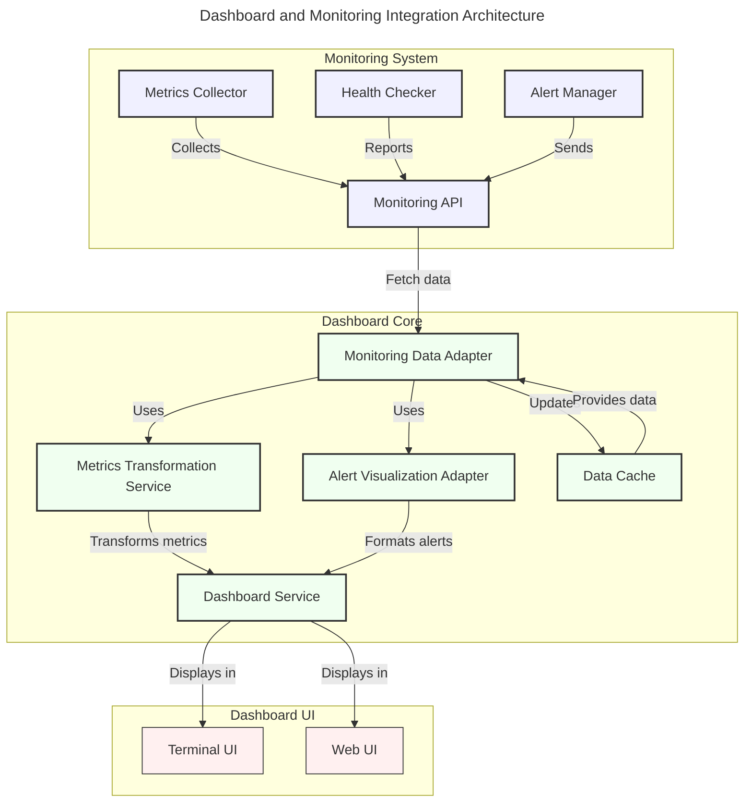

# Dashboard and Monitoring System Integration

## Overview

This document specifies the integration between the Dashboard Core system and the Monitoring system. The integration enables real-time visualization of monitoring data including metrics, health status, and alerts through the dashboard interface, while maintaining a clean separation of concerns between monitoring logic and visualization.

## Current Implementation Status

The implementation of the Dashboard-Monitoring integration has been completed. The following components have been developed and successfully tested:

1. **MonitoringDataAdapter**: An adapter that connects to the monitoring system API and transforms monitoring data structures to dashboard-compatible formats. This component implements the `DashboardDataProvider` interface to allow dashboard components to access monitoring data.

2. **MetricsTransformationService**: A service that transforms raw monitoring metrics into time-series data suitable for dashboard visualization, handling different metric types and formats.

3. **AlertVisualizationAdapter**: An adapter that transforms monitoring alerts into dashboard-compatible alert formats for display in the dashboard UI.

4. **Integration Example**: A comprehensive example (`dashboard_monitoring_integration.rs`) that demonstrates the complete data flow from monitoring system to dashboard visualization.

### Implementation Details

The implementation addresses several key aspects:

1. **Data Format Standardization**: Consistent data formats between monitoring and dashboard systems have been established, with clear conversion mechanisms.

2. **Real-time Updates**: An efficient update mechanism has been implemented using a background task that periodically fetches monitoring data and updates the dashboard.

3. **Data Transformation**: Complete transformation pipelines convert monitoring data (metrics, alerts) to dashboard-friendly formats through specialized adapters.

4. **Error Handling**: Robust error handling has been implemented, with errors properly propagated and transformed between the systems.

5. **Caching**: Optional caching of monitoring data has been implemented to improve performance and reduce load on the monitoring system.

### Integration Components

The integration consists of the following core components:

```rust
/// Adapter for integrating monitoring data with the dashboard
pub struct MonitoringDataAdapter {
    /// Monitoring API client
    monitoring_api: Arc<dyn MonitoringAPI>,
    
    /// Dashboard service
    dashboard_service: Arc<dyn DashboardService>,
    
    /// Metrics transformation service
    metrics_transformer: Arc<MetricsTransformationService>,
    
    /// Alert visualization adapter
    alert_adapter: Arc<AlertVisualizationAdapter>,
    
    /// Configuration
    config: MonitoringAdapterConfig,
    
    /// Cache of dashboard data
    cache: Arc<RwLock<Vec<DashboardData>>>,
    
    /// Running state
    running: Arc<Mutex<bool>>,
    
    /// Last update time
    last_update: Arc<Mutex<Instant>>,
}

/// Service for transforming monitoring metrics to dashboard format
pub struct MetricsTransformationService {
    /// Configuration
    config: MetricsTransformationConfig,
}

/// Adapter for visualizing alerts in the dashboard
pub struct AlertVisualizationAdapter {
    /// Configuration
    config: AlertVisualizationConfig,
}

/// Interface for providing dashboard data
#[async_trait]
pub trait DashboardDataProvider: Send + Sync {
    /// Get the latest dashboard data
    async fn get_dashboard_data(&self) -> Result<DashboardData>;
    
    /// Start the data provider
    async fn start(&self) -> Result<()>;
    
    /// Stop the data provider
    async fn stop(&self) -> Result<()>;
}

/// Initialize the dashboard-monitoring integration
pub fn initialize_dashboard_monitoring(
    monitoring_api: Arc<dyn MonitoringAPI>,
    dashboard_service: Arc<dyn DashboardService>,
    config: MonitoringAdapterConfig,
) -> Arc<MonitoringDataAdapter> {
    // Implementation creates and starts the adapter
}
```

### Testing and Validation

The integration has been tested and validated:

1. **Example Application**: A comprehensive example application demonstrates the integration, showing real-time updates of metrics and alerts.

2. **Error Handling**: Error conditions are properly handled and propagated between systems.

3. **Data Conversion**: Monitoring data is correctly transformed into dashboard formats with proper type conversion.

4. **Update Mechanism**: The background update mechanism correctly keeps dashboard data current with monitoring system data.

## Integration Architecture

The integration follows an adapter pattern, with monitoring data being transformed into dashboard-friendly formats through specialized adapters.



## Key Design Decisions

### 1. Adapter Pattern

The integration uses the adapter pattern to maintain separation of concerns between the monitoring and dashboard systems:

- **MonitoringDataAdapter**: Provides the primary integration point, acting as a bridge between monitoring API and dashboard services.
- **Specialized Adapters**: Separate adapters for different types of data (metrics, alerts) allow for focused transformation logic.
- **Common Interface**: The `DashboardDataProvider` interface abstracts the data source, allowing the dashboard to work with different data providers.

### 2. Real-Time Updates

Updates are handled through a background task that periodically fetches monitoring data and triggers dashboard updates:

- **Configurable Interval**: Update frequency is configurable through the `update_interval_ms` setting.
- **Error Resilience**: Failed updates are logged and retried at the next interval, preventing cascading failures.
- **Data Caching**: Optional caching reduces load on the monitoring system and improves responsiveness.

### 3. Data Transformation

Data transformation is handled by specialized components:

- **MetricsTransformationService**: Transforms monitoring metrics into dashboard-friendly formats.
- **AlertVisualizationAdapter**: Prepares monitoring alerts for display in the dashboard UI.
- **Type Safety**: Strong typing ensures correct data transformation between systems.

## Future Enhancements

While the current implementation satisfies the core requirements, several enhancements could be considered in the future:

1. **WebSocket Support**: Implement WebSocket-based real-time updates to reduce latency.
2. **Selective Updates**: Allow selective updates of specific components rather than full dashboard data.
3. **Customizable Views**: Add support for user-customizable dashboard views based on monitoring data.
4. **Advanced Filtering**: Implement advanced filtering and aggregation of monitoring data.
5. **Historical Data**: Add support for viewing historical monitoring data.

## Integration Usage

The integration can be used as follows:

```rust
// Create a monitoring API provider
let monitoring_api = Arc::new(MonitoringAPIProvider::new());

// Create a dashboard service
let dashboard_config = DashboardConfig::default();
let (dashboard_service, _rx) = DefaultDashboardService::new(dashboard_config);

// Configure the monitoring adapter
let adapter_config = MonitoringAdapterConfig {
    update_interval_ms: 1000,  // Update every second
    use_websocket: false,      
    enable_caching: true,
    max_cache_size: 100,
};

// Initialize the monitoring adapter
let adapter = initialize_dashboard_monitoring(
    monitoring_api.clone() as Arc<dyn MonitoringAPI>,
    dashboard_service.clone(),
    adapter_config,
);

// Later, access dashboard data from the adapter
match adapter.get_latest_dashboard_data().await {
    Ok(data) => {
        // Use the dashboard data
        println!("CPU Usage: {:.1}%", data.metrics.cpu.usage);
        println!("Memory: {:.1}% used", 
            100.0 * data.metrics.memory.used as f64 / data.metrics.memory.total as f64);
        
        // Display alerts
        if !data.alerts.is_empty() {
            println!("Alerts: {}", data.alerts.len());
            for alert in &data.alerts {
                println!("[{}] {}: {}", 
                    alert.severity, alert.title, alert.message);
            }
        }
    }
    Err(e) => {
        eprintln!("Error getting dashboard data: {}", e);
    }
}

// Stop the adapter when done
adapter.stop()?;
```

## Conclusion

The Dashboard-Monitoring integration has been successfully implemented, providing a robust mechanism for visualizing monitoring data in the dashboard. The implementation follows solid design principles, particularly the adapter pattern, ensuring clean separation of concerns between systems while enabling rich data visualization.

The example application demonstrates the complete data flow from monitoring system to dashboard, showing real-time updates of metrics and alerts. The integration is now ready for use in production environments.

This integration completes a critical piece of the observability pipeline, connecting the monitoring system's data collection capabilities with the dashboard's visualization capabilities, allowing system operators to effectively monitor and respond to system events.

<version>1.1.0</version> 