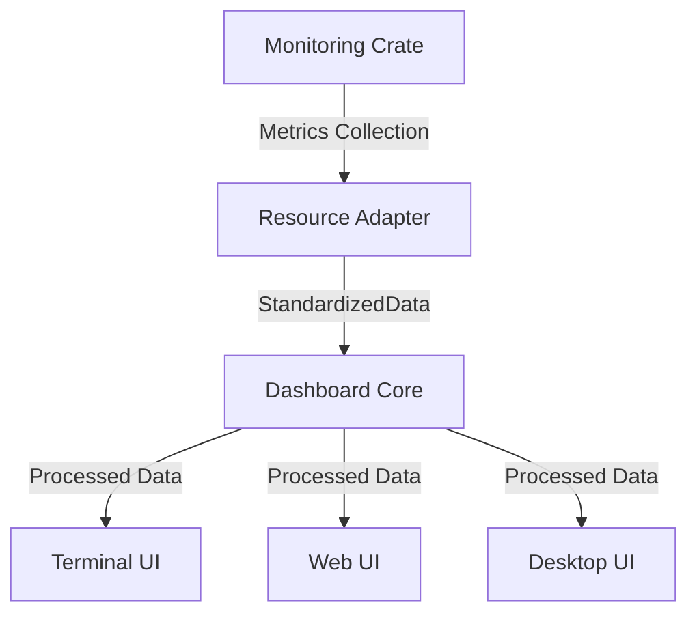

# Monitoring and Dashboard Integration Example

This document provides working code examples showing the proper integration between the monitoring crate and dashboard components.

## Integration Flow



## Complete Integration Example

```rust
use std::sync::Arc;
use tokio::sync::mpsc;

// Monitoring crate imports
use squirrel_monitoring::metrics::{
    ResourceMetricsCollector,
    NetworkMetricsCollector,
    MetricsSnapshot
};

// Dashboard core imports
use dashboard_core::{
    config::DashboardConfig,
    service::DefaultDashboardService,
    data::{SystemSnapshot, NetworkSnapshot},
    update::DashboardUpdate
};

// Terminal UI imports
use ui_terminal::TuiDashboard;

// Example adapter to convert between monitoring and dashboard data formats
struct MonitoringToDashboardAdapter {
    resource_collector: ResourceMetricsCollector,
    network_collector: NetworkMetricsCollector,
}

impl MonitoringToDashboardAdapter {
    fn new() -> Self {
        Self {
            resource_collector: ResourceMetricsCollector::new(),
            network_collector: NetworkMetricsCollector::new(),
        }
    }
    
    // Convert monitoring metrics to dashboard format
    fn collect_dashboard_data(&mut self) -> (SystemSnapshot, NetworkSnapshot) {
        // Collect system metrics
        let system_metrics = self.resource_collector.collect();
        
        // Convert to dashboard format
        let system_snapshot = SystemSnapshot {
            cpu_usage: system_metrics.cpu_usage,
            memory_used: system_metrics.memory_used,
            memory_total: system_metrics.memory_total,
            disk_used: system_metrics.disk_used,
            disk_total: system_metrics.disk_total,
            load_average: [
                system_metrics.load_average[0],
                system_metrics.load_average[1],
                system_metrics.load_average[2]
            ],
            uptime: system_metrics.uptime,
        };
        
        // Collect network metrics
        let network_metrics = self.network_collector.collect();
        
        // Convert to dashboard format
        let mut interfaces = std::collections::HashMap::new();
        
        for (name, interface) in &network_metrics.interfaces {
            interfaces.insert(name.clone(), dashboard_core::data::InterfaceStats {
                name: name.clone(),
                rx_bytes: interface.rx_bytes,
                tx_bytes: interface.tx_bytes,
                rx_packets: interface.rx_packets,
                tx_packets: interface.tx_packets,
                is_up: interface.is_up,
            });
        }
        
        let network_snapshot = NetworkSnapshot {
            rx_bytes: network_metrics.rx_bytes,
            tx_bytes: network_metrics.tx_bytes,
            rx_packets: network_metrics.rx_packets,
            tx_packets: network_metrics.tx_packets,
            interfaces,
        };
        
        (system_snapshot, network_snapshot)
    }
}

// Complete example: Monitoring + Dashboard Core + Terminal UI
#[tokio::main]
async fn main() -> Result<(), Box<dyn std::error::Error>> {
    // Create dashboard config
    let config = DashboardConfig::default()
        .with_update_interval(5)  // 5 seconds
        .with_max_history_points(1000);
    
    // Create dashboard service
    let (dashboard_service, rx) = DefaultDashboardService::new(config);
    
    // Create monitoring adapter
    let mut adapter = MonitoringToDashboardAdapter::new();
    
    // Start dashboard service
    dashboard_service.start().await?;
    
    // Spawn a task to periodically collect metrics and update the dashboard
    let dashboard_service_clone = dashboard_service.clone();
    tokio::spawn(async move {
        let mut interval = tokio::time::interval(tokio::time::Duration::from_secs(5));
        
        loop {
            interval.tick().await;
            
            // Collect metrics
            let (system, network) = adapter.collect_dashboard_data();
            
            // Update dashboard data
            if let Ok(mut data) = dashboard_service_clone.get_dashboard_data().await {
                data.system = system;
                data.network = network;
                data.timestamp = chrono::Utc::now();
                
                // Send update
                let update = DashboardUpdate::FullUpdate(data.clone());
                // In a real implementation, this would be handled by the dashboard service itself
            }
        }
    });
    
    // Create and run terminal UI
    let mut terminal_ui = TuiDashboard::new_from_default_service((dashboard_service, rx));
    terminal_ui.run().await?;
    
    Ok(())
}
```

## Standardized Monitoring Collection Patterns

To ensure consistency across the codebase, all system metrics collection should follow these patterns:

### System Metrics Collection

```rust
pub fn collect_system_metrics(system: &mut System) -> SystemMetrics {
    // Always refresh before collecting metrics
    system.refresh_all();
    
    // CPU usage
    let cpu_usage = system.global_cpu_info().cpu_usage();
    
    // Memory
    let memory_used = system.used_memory();
    let memory_total = system.total_memory();
    
    // Disk
    let disks = system.disks();
    let mut disk_used = 0;
    let mut disk_total = 0;
    
    for disk in disks {
        disk_used += disk.total_space() - disk.available_space();
        disk_total += disk.total_space();
    }
    
    // Create metrics
    SystemMetrics {
        cpu_usage,
        memory_used,
        memory_total,
        disk_used,
        disk_total,
        load_average: [0.0, 0.0, 0.0], // Replace with actual if available
        uptime: system.uptime(),
    }
}
```

### Network Metrics Collection

```rust
pub fn collect_network_metrics(system: &mut System) -> NetworkMetrics {
    // Always refresh before collecting metrics
    system.refresh_networks();
    
    let networks = system.networks();
    
    // Total counters
    let mut rx_bytes = 0;
    let mut tx_bytes = 0;
    let mut rx_packets = 0;
    let mut tx_packets = 0;
    
    // Collect interfaces
    let mut interfaces = std::collections::HashMap::new();
    
    for (name, network) in networks {
        // Get interface metrics
        let rx_bytes_interface = network.received();
        let tx_bytes_interface = network.transmitted();
        
        // Update totals
        rx_bytes += rx_bytes_interface;
        tx_bytes += tx_bytes_interface;
        
        // Store interface metrics
        interfaces.insert(name.clone(), InterfaceMetrics {
            name: name.clone(),
            rx_bytes: rx_bytes_interface,
            tx_bytes: tx_bytes_interface,
            rx_packets: 0, // Fill if available
            tx_packets: 0, // Fill if available
            is_up: true,   // Fill with actual status if available
        });
    }
    
    // Create metrics
    NetworkMetrics {
        rx_bytes,
        tx_bytes,
        rx_packets,
        tx_packets,
        interfaces,
    }
}
```

## Testing the Integration

A basic integration test should verify that monitoring metrics can be properly converted to dashboard format:

```rust
#[test]
fn test_monitoring_dashboard_integration() {
    // Create monitoring collectors
    let mut resource_collector = ResourceMetricsCollector::new();
    let mut network_collector = NetworkMetricsCollector::new();
    
    // Collect metrics
    let system_metrics = resource_collector.collect();
    let network_metrics = network_collector.collect();
    
    // Convert to dashboard format (should compile without errors)
    let system_snapshot = SystemSnapshot {
        cpu_usage: system_metrics.cpu_usage,
        memory_used: system_metrics.memory_used,
        memory_total: system_metrics.memory_total,
        disk_used: system_metrics.disk_used,
        disk_total: system_metrics.disk_total,
        load_average: [
            system_metrics.load_average[0],
            system_metrics.load_average[1],
            system_metrics.load_average[2]
        ],
        uptime: system_metrics.uptime,
    };
    
    // Basic validation
    assert!(system_snapshot.cpu_usage >= 0.0 && system_snapshot.cpu_usage <= 100.0);
    assert!(system_snapshot.memory_used <= system_snapshot.memory_total);
    assert!(system_snapshot.disk_used <= system_snapshot.disk_total);
    
    // Network conversion can be tested similarly
}
```

By following these standardized patterns and example code, the monitoring and dashboard components will integrate seamlessly and provide a consistent user experience. 