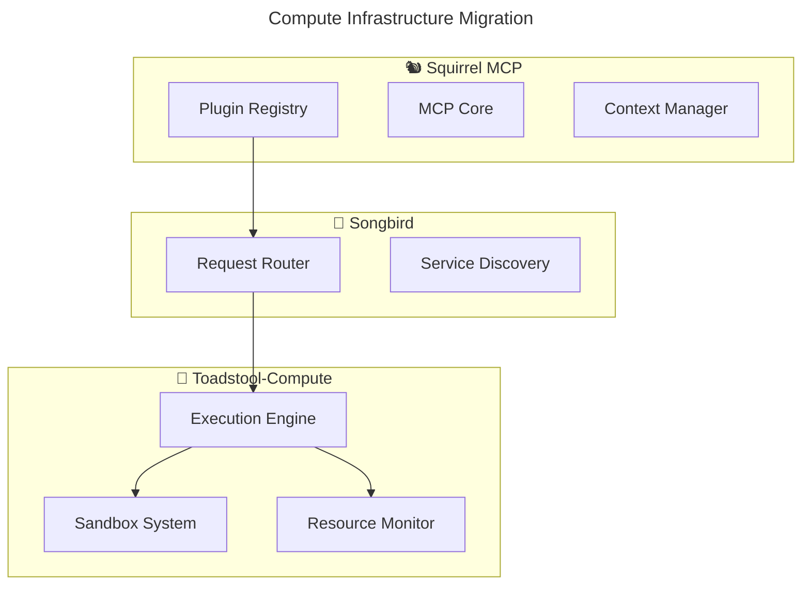

# 🍄 Toadstool-Compute Infrastructure Migration

## Overview

This directory contains the compute infrastructure components that are being moved from Squirrel to **Toadstool-Compute** as part of the ecosystem refocusing effort.

## What's Here

### **🔒 Sandbox Infrastructure** (`sandbox/`)
Complete cross-platform plugin sandboxing system:
- **Linux**: seccomp, namespaces, capabilities
- **macOS**: App Sandbox, TCC integration
- **Windows**: Job Objects, restricted tokens
- **Cross-platform**: Unified abstraction layer

### **📊 Resource Monitoring** (`resource-monitoring/`)
- Resource usage tracking and limits
- Performance monitoring
- Resource enforcement policies

### **🔧 SDK Components** (`sdk/`)
- Sandbox configuration and management
- Security level abstractions
- Permission management

## Architecture Separation



## Migration Status

- [x] **Sandbox Infrastructure**: Cross-platform sandbox implementations
- [x] **Resource Monitoring**: Resource tracking and enforcement
- [x] **SDK Components**: Sandbox configuration and management
- [ ] **Integration Layer**: Toadstool client integration (Next step)
- [ ] **Handoff Complete**: Remove from Squirrel codebase (Next step)

## Next Steps

1. **Toadstool Team**: Integrate these components into Toadstool-Compute
2. **Squirrel Team**: Replace with Toadstool client calls
3. **Songbird Team**: Establish routing between Squirrel and Toadstool
4. **Final Cleanup**: Remove sandbox code from Squirrel

## Files Moved

### From `code/crates/services/app/src/plugin/sandbox/`
- `basic.rs` - Basic sandbox implementation
- `capabilities.rs` - Linux capabilities management
- `cross_platform.rs` - Cross-platform abstractions
- `errors.rs` - Sandbox error types
- `linux/` - Linux-specific implementations
- `macos/` - macOS-specific implementations
- `mod.rs` - Module definitions
- `seccomp.rs` - Linux seccomp filters
- `testing.rs` - Sandbox testing utilities
- `traits.rs` - Sandbox trait definitions
- `windows.rs` - Windows-specific implementations

### From `code/crates/sdk/src/`
- `sandbox.rs` - SDK sandbox API and configuration

### From `code/crates/services/app/src/plugin/`
- `resource_monitor.rs` - Resource monitoring system

## Integration Pattern

Once integrated into Toadstool-Compute, Squirrel will use this pattern:

```rust
// Squirrel → Songbird → Toadstool execution
let execution_request = ExecutionRequest {
    plugin_id: "example-plugin",
    mcp_context,
    sandbox_config: SandboxConfig::default(),
};

let result = songbird_client
    .route_compute_request("toadstool-compute", execution_request)
    .await?;
```

---

**🎯 This migration enables Squirrel to focus on MCP platform excellence while Toadstool specializes in compute infrastructure! 🐿️🍄** 